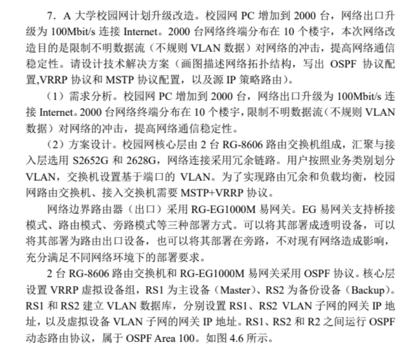
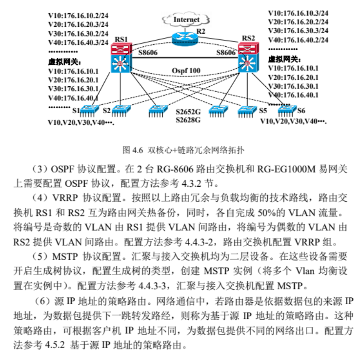
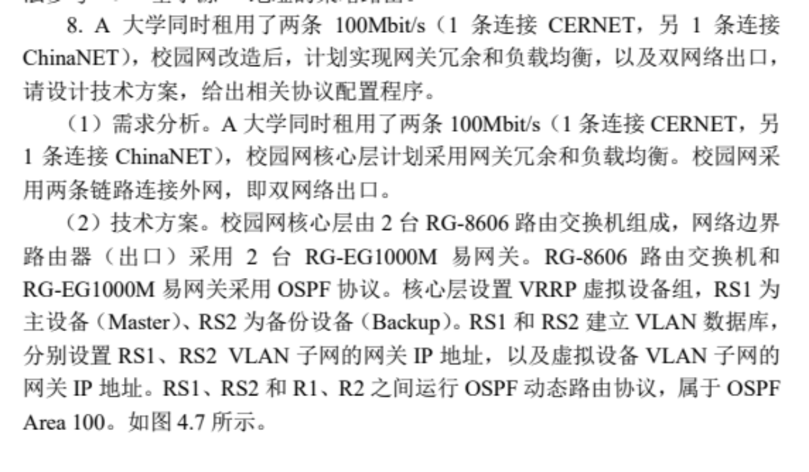
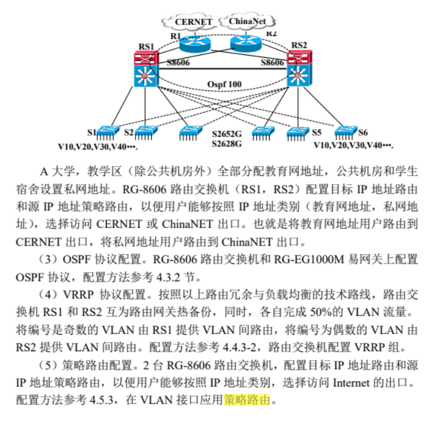

# 网络考试

### 选择题*10（20分）

*问：mstp，vrrp，rip，OSPF，acl，ipv6等特点。*

+ #### MSTP：（Multiple Spanning Tree Protocol）

  + 支持多个vlan共享一个生成树
  + 提供冗余连接
  + 防止广播风暴
  + 提升网络性能和可靠性

+ #### vrrp：（Virtual Router Redundancy Protocol）

  + 多个路由器组成一个虚拟路由器
  + 多个路由器共享一个IP
  + 发生故障时快速转移
  + 提升抗灾型、容错性、可靠性

+ #### RIP：（Routing Information Protocol）

  + 距离向量的路由协议
  + 通过跳数来衡量开销
  + 30s更新路由表
  + 简单 容易部署
  + 路由表包含协议哪全部路由信息

+ #### OSPF（Open Shortest Path First）

  + 基于链路状态的路由协议
  + 在大型网络中选择最短路径
  + 通过洪泛算法传递链路状态信息，根据开销值计算最短路径
  + 快速收敛
  + 高可靠性高扩展性

+ #### ACL（Access Control List）

  + 一种控制网络访问的安全策略
  + 控制方式：（过滤 转发 拒绝）
    + 源IP地址
    + 目的IP地址
    + 协议类型
    + 段口号
  + 有效保护隐私，对网络流量精确控制and防护

+ #### IPV6（Internet Propocol Version 6）

  + 解决V4地址耗尽 安全性的问题
  + 128位地址
  + 简化报文格式
  + 支持更多服务类型
  + 允许协议继续演变

***

*问：静态路由和默认路由的特点*

+ 静态路由：
  + 配置灵活
  + 管理员手动配置
  + 对路由器的负担小
  + 需要手动修改，不方便
+ 默认路由
  + 特殊的静态路由
  + 用于将数据包引导至特定的地方，例如出口、边界
  + 减少路由表数量，适用于简单网络环境
  + 多个默认路由容易不稳定

***

*交换机的交换技术*

+ 存储转发
+ 快速转发
+ 自由分段

***

*路由器的交换技术*

+ 实现不同网络协议的互联
+ 对数据处理，收发数据包
+ 对数据分组过滤、复用、加密、压缩及防护
+ 依照路由表对数据包进行转发
+ 根据路由协议与相邻路由器交换路由表
+ 网络管理
  + acl
  + 策略路由

***

***

### 填空题*10（20分）

1. ipv4向ipv6过度方法有：

   1. 双协议栈
   2. 兼容两种地址
   3. 基于ipv4隧道的ipv6
2. 网络工程设计与实施的阶段分为：

   1. 工程设计
   2. 工程实施
   3. 工程验收
3. UPS简称，分为什么

   1. 不间断电源**Uninterruptible Power Supply**
   2. 工频&高频
4. 快速以太网的速率：
   1. 100Mbitps
5. 集群的作用是：
   1. 高可靠性
   2. 可扩展性
   3. 抗灾难性
6. 想在网络usually采用什么层和什么层的扁平结构？
   1. 核心层
   2. 接入层
7. 一般情况网络拓扑最好使用 ____ 或者树状结构以减少淡点故障便于网络涉诶管理与维护？
   1. 星状结构
8. 园区网核心路由器是一种具有（）功能的交换机，称为（）交换机或（）交换机。
9. 路由协议的作用是建立和维护（）
10. 边界路由器与外部网络有一条点到点的数据链路，采用：（）（）。
    1. 静态路由
    2. 默认路由
11. 云计算服务方式分为：（）（）（）
    1. 公有云
    2. 私有云
    3. 混合云

***

***

### 简答题*5（30分）

1. #### 网络需求分析的要点有哪些

   1. 网络综合布线，通信平台，服务器，网络操作系统，网络应用系统，网络管理维护，网络安全
   2. 了解用户需求，对原有网络进行改进升级

2. #### 项目经理的职责

   1. 组织开发人员和用户一起需求分析
   2. 组织项目开发技术骨干，或者全体成员于用户讨论，来编写“网路工程解决方案设计书（初稿）”。
   3. 组织专家，对网络工程解决方案设计书反复修改，确定其正式文档
   4. 邀请有能力的用户参与编写于确定网络工程解决设计方案初稿
   5. 项目过大的话，要能够组织专家一同参与网络工程解决方案设计书确定过程

3. #### 解释策略路由与路由映射图的概念

   1. 策略路由：
      1. 策略路由是一种支持数据包按照既定规则路由及转发的技术。
      2. 策略路由可以根据源IP地址、数据包的协议类型、端口号、服务类型等多种因素来决定路由路径。这使得网络管理员可以根据特定的需求和策略来控制数据包的流动，例如实现负载均衡、流量控制、服务质量（QoS）等。
   2. 路由映射图：
      1. 路由映射图决定了下一个数据包的下一跳转发路由设备的端口地址
      2. 包含了很多访问控制列表（策略），可任意插入或删除

4. #### 简述路由器在园区网的作用

   1. 作为边界路由器
      1. 内外网的连接
      2. 数据的处理分析与转发
   2. 作为核心路由器
      1. 实现多个局域网互联
      2. 也可以实现vlan间通信
      3. 负载均衡

5. #### 简述无线局域网结构类型

   1. 无中心网络
      1. 不需要ap，所有基站对等通信
   2. 有中心网络
      1. 例如无线接入局域网
      2. ap与ap+ac的网络
   3. 点对点网络
      1. 中继方式
      2. 两个设备直接建立连接

6. #### 简述服务器的分类

   1. 文件服务器
   2. 数据库服务器
      1. 存储数据，数据库分布式操作与集中管理
   3. 网络通用服务器
      1. 用于网络基础访问
      2. 包括www、email、FTP、dns等
   4. 功能服务器
      1. 提供特定功能，例如打印、音频、流媒体

7. #### 常用网络防护措施

   1. 身份验证
   2. 防火墙
   3. 系统监控
   4. 信息过滤
   5. 加密
   6. 备份与隔离
   7. 用户权限控制
   8. 网络代理，保护源IP

8. #### 简述ACL作用以及分类和设置位置

   1. 作用：
      1. 控制网络数据
      2. 限制网络流量
      3. 提升网络效率
      4. 提升网络安全性
   2. 分类
      1. 标准ACL：基于源IP地址进行过滤，只能控制流量源地址
      2. 扩展ACL：除了源IP地址，还可以根据目的IP、协议类型、端口号等因素控制过滤
      3. 命名ACL：使用用户自定义名称来标识ACL，提高可读性和管理性

9. #### 简述网络性能的常用指标

   1. 相应时间
      1. 相应时间是判断网络性能的重要标准
   2. 并行用户数量
      1. 支持大量并行用户访问
   3. IT成本
      1. 网络设备与结构组合以及运维相关
   4. 标准与峰值
      1. 这两个特性对前面3个因素产生影响
   5. 压力造成的降级
      1. 网络系统超过了系统负载极限，就会降级
   6. 可靠性
      1. 指网络系统长时间运行性能与最初24小时运行性能的比较

10. #### 简述服务器集群的功能

    1. 高可用性：通过服务器集群，资源所有会从故障服务器转移到可用的服务器
    2. 负载均衡：通过多个节点有效分担系统负载
    3. 容错与备份：服务器相互备份，提升抗灾型
    4. 提高性能：多台服务器集群并行处理任务，提高性能与效率
    5. 资源共享：服务器共享硬件资源、网络资源和网络资源，降低成本提升利用率

***

***

### 设计题*1（30分）

### P109-7:





##### 配置：

+ OSPF 配置：
  + Ospf的配置：图中的RW1~RW5，最先启动的被选举成DR。如果RW1~RW5中任意两个同时启动，或者重新选举，则看接口优先级（范围0~255)，优先级最高的被选举成DR。默认情况下，多路访问网络接口优先级为1。点到点网络接口优先级为O。修改接口优先级的命令是“ip ospf priority”，如果接口优先级被设置为0，则该接口不参加DR选举。

+ 主核心设备VRRP配置。

  + ```RS1(config)# interface vlan 10 ;配置Vlan10的IP地址
    RS1(config-if)# ip address 176.16.10.2 255.255.255.0
    
    RS1(config-if)# standby 1 ip 176.16.10.1 ;配置vlan10的虚拟网关IP
    
    RS1(config-if)# standby 1 preempt ;设为抢占模式。
    ```

+ 汇聚层配置MSTP

  + ```S1(config)#spanning-tree ;开启生成树协议
    S1(config)#spanning-tree ;开启生成树协议
    S1(config)#spanning-tree mode mstp ;配置生成树类型S1(config)#spanning-tree mst configuration
    S1(config-mst)#instance 1 vlan 10,30
    S1(config-mst)#revision 1 ;配置多生成树的版本号S1(config-mst)#instance 2 vlan 20,40 ;
    S1(config-mst)#revision 1 S1(config-mst)#exit
    ```

+ 基于源IP地址的策略路由（边界路由器）

  + ```sisco
    R1(config)#access-list 1 permit 176.16.1.11 ;
    R1(config)#access-list 2 permit 176.16.1.12;设置主机B允许访问列表
    R1(config)#route-map RULE1 permit 10 ;设置主机A的策略路由序号为10
    R1(config-route-map)#match ip address 1 ;设置匹配地址access-list 1
    R1(config-route-map)#set ip next-hop 176.16.12.1;设置数据包的下一跳地址
    R1(config)#route-map RULE1 permit 20 ;设置主机B的策略路由序号为20
    ```

***

### P110-8:





