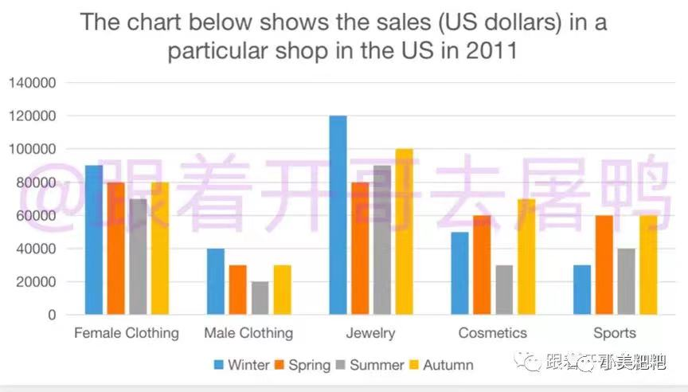

## 小作文练习

### 1

The line graph illustrates the changes in the proportion of cinema visitors between four different age groups in 20 years from 1990 to 2010.

As can be clearly seen from the figure, the percentage of 44-45 age group accounted for the largest proportion during the whole period, whereas the smallest figure can be seen in the percentage of the 14-24 age group. The former fluctuated between about 35% and 40% in the first 10 years of the period. Then, this soared, with the figure rising to above 50% in 2010. By contrast, the latter oscillated in the first 10 years. After that, this returned to 20% in 2005 and remained stable during the rest of the period.

Looking at the details in the 24-34 and the 34-44 age groups, the trends in two groups were almost the same. the figure oscillated drastically around 8% from 1990 to 2000. Then, rocketed dramatically rising to higher 30% and 40% in 2005. In the remaining period, 24-34 group kept unchanged, and the 34-44 rose mildly to about 44%.

To sum up, the four figures presented a similar trend, and turned to a upward trend after 2000.

### 2

The line graphs illustrate the climate changes about daily sunshine and temperature in a year in two Australia cities.

As can be clearly seen from the first line graph, the figure for Melbourne and Darwin shows a similar trend. Specifically, the temperature of Melbourne grows mildly with the figure rising from 18 degrees in January to 30 in August and reaches the top. During the rest of the period in a year, the temperature plunges to 21 degrees. By contrast, this of Darwin climbs steadly to the peak form 6 in January to 18 in July. Then, this plummets dramatically, decreasing to lower 9 degrees.

Looking at the details of the second line graph, the average period of sunlight of Melbourne decreases continuously from 10 hours in January to 6 hours in about May. Then, keeps unchanged until September, and in the remaining three mounths this increases continuously beyond Melbourne to 10 at the end of the year.

To sum up, Melbourne's annual temperatures is lower than Darwin's by about 10 degrees averagely, while the sunshine hours of Darwin are more than Melbourne in the summer time.

### 3

The bar charts illustrate the figure for the rare of vehicle arriving on time and the quantities of advises from passengers in an American bus company in 4 years from 1999 to 2003.

The first bar chart illustrates the percentage of bus arriving on time in actual and target respectively. In the 1999, the figure for actual is slightly more than the target, at slightly over than 80% and 80% respectively. However, the proportion of them plummeted dramatically from about 80% in 1999 to around 40% in 2000. At the same time, the proportion for target beyoned the actual(just higher 40%). Then, a two-years period witnessed a stable figure for them, taking up about 40%. Finally, the percentage of actual soared dramatically from around 40% to just lower than 80% in 2003, whereas target decreased mildly in this year, at moderately lower than 40%.

Looking at the second bar chart, there is a drastic growth in the number of unsatisfied guests with the figure rising from about 60 in 1999 to lower than 100 in 2000. Then, the figure returned to just above 50 in 2001. During the rest of the period, the quantity of this climbed continuously to around 120 In 2003.

To sum up, it is clear that the more amount of gaps between the proportion of actual and target, the more number of complains will be generated.

### 4流程图作业(waiting to write)

The flow charts illustrate the processes of making cement and the raw materials of concrete.

Looking at the first diagram, there are about 5 steps for producing cement. To begin with, limestones and clay, the ingredients of cement, are crushed into power by a crusher. Subsequently, it is sended into a tube after a mixer. After that, the compounds transmitted into a rotating heater that heat the powder. Next, heated power turns into the cement after which grinde by a grinder. The end of the process of the cement is markde by packing cement into the bags.

The second diagram demonstrates the percentage of the concrete's raw materials. It is clear that concrete is made of a few water, a small amount of cement, some sand and a large rate of small stones. In the four materials, the proportion of the gravel is the biggest, at a half of the sum. By contrast, the percentage of water is the smallest, just accounting for 10%. Also, the rate of the sand takes up one second of the small stones(25%). Finally, the ratio of the cement is second lest, by 15%. 

~~~To sum up, the final phase of the concrete is marked by the rotation of the concrete mixer which mixs the all raw materials and come up with the final procuct - the concrete.
~~~

### 5 柱状图高难度作业，可7

The bar char  demonstrates the figure for sales in the five categories of goods within four seasons in 2011 measured with US dollars.

Specifically, the amount of the jewelry accounted for the highest proportion in the other five goods(about 100000 averagely), which plummeted dramatically from 120000 in winter to 80000 in spring. Subsequently, it climbed continuously for the rest of the perid in this year, rising to 100000. By contrast, the sales of male clothing accounted for the smallest percentage in them. Specifically, the figure for it dropped consistently during the first three seasons with the figure decreasing from 40000 in winter to 20000 in summer. Afterwarders it returned to about 30000 in autumn. At the same time, the trend of female clothing is almost the same with the male, which is higher than male around 50000 respectively.

Looking at the details, the the income of cosmetics plunged drastically diving to close to 30000 in summer after which remained stable during winter and spring nearby 50000. Afterwards, it soared fiercely to over 70000 in autumn. However, the figure for sports oscillated significantly between roughly 40000 and 60000 throughout this year.

To sum up, the sale of clothes and jewelry is ranked the highest in winter, which is followed by the figure in autumn.

***

### 6 可高分饼图

> 未批改：1.24
>
> 2.0

The three pie charts compares the varations in the proportion of school running costs by five different categories in separated three years in UK.

The first pie chart demonstrates the figure in 1981 and at the same time the figure for teachers' incomes ranked at the top, with 40%, which was followed by the figure for other workers' wages, at 28%. However, a smallest proportion can be seen in the percentage of insurance, only accounting for 2%. Moreover, the rate of resources such as books and furniture/equipment was the same, making up 15% respectively.

Compared with the aforementioned figures, the percentage of insurance increased mildly during the first 10 years, which was followed by an substential growth to 8% in 2001. The figure for teachers's incomes oscillated between 40% and 50% with a two-decades's period. Noticeably, 1991 and 2001 witnessed a definitely opposited trend in the proportion of furniture and equipment, and resources with the former shrinking to 5% before reaching the top(23%), and the latter plunging drastically to 9% before rosing mildly in 1991, increasing by 5%.

To sum up, it is clearly that the proportion of teachers' wages accounted for the highest part in the whole periods of the school runnign fees.

The three pie charts demonstrate the figure for the particular school annual spending in the United Kingdom of Great Britain and the Northen Ireland within 1981, 1991, and 2001 respectively.

The first pie chart illustrates the figure for fees in 1981, Specifically, the teacher's salaries ranked at the top, by 40%, which was followed by the percentage of other workers' salaries, accounting for about 30%. By contrast, the proportion of insurance was made up about only 2%. Also, an equal percentage can be seen in the remaining figures, which was resources such as books as well as furnitures and equipments at 15% respectively.

Looking at the details of the second pie chart, The prcentage of teachers' salaries accounted a half of the sum(50%). The rest of the figures was splited out into four parts wihle the figure for other workers' salaries and resources were almost the same, by 21% averagely. Also, the rate of insurance ranked at the smallest, which was followed by the proportion of furnitures and equipments.

The last pie chart showed the spending in 2001. there was a dramatic climb in the figure for furnitures and equipments from 5% in 1991 to 23% in 2001. At the same time, resources halved, decreasing to about one-tenth. Also, the proportion of two form of salaries shrinked about 6% respectively. And the insurance grew mildly, rising to 8% in 2001.

***

# 大作文作业

#### Some people said the government should not spend money on building theaters and sports stadiums. Instead, it should spend money on medical care and education. Do you agree or disagree?

| 让步 | 将金钱花费在医疗与教育上确实能在生活上帮助孩子与老人 |
| ---- | ---------------------------------------------------- |
| 主体 |                                                      |

***

#### By the year 2050, the traditional way of teachers and students in the class will not exist. To what extent do you agree or disagree?

| 让步 | 网络教学方式可以方便更多学生与老师连接，但传统教育有着不可替代的优势 |
| ---- | ------------------------------------------------------------ |
| 主体 | 实操性的工作需要当面指导 在线的课程看重学生的自觉性，学生可能被周围环境干扰，例如家人、宠物 |

1. 开头
2. Admittedly, there is no doubt that the newest studying form of online is a good motivator to help some remote students who can accept modern education properly. It is true that the internet is a solid bridge between the best teachers living in the metropolis and students living in the remote bridges. This might be true to some extent. However, the claim could not hold water, which is on account of the fact that there are still a small number of poverty-stricken regions which are not covered by internet; thus, those people living in there have no idea to got the newest education through the internet.
3. It is necessary to emphasize an important point that compare with latest form of learning, the traditional face-to-face teaching method has numerous irreplaceable advantages. Primily, the form of online teaching can only provides video and voice streams to each other, whereas classic teaching ways can beyond that such as physical instruction and figure demonstrating. Secondarily, students studying from home are easier to be affected by environments. For example, there are a large number of families that have a pet, like cat or dog. In a certain case, for instance, cats may stand on the keyboard or dogs pooped; thus, these students have to clean the shit or move the cat from the table or the keyboard.

***

#### Increasing the price of petrol is the best way to solve traffic congestion. Do you agree or disagree?

| 让步 | 石油可以短期降低交通拥堵，但不值得提倡                       |
| ---- | ------------------------------------------------------------ |
| 主体 | 石油上涨造成电动车激增，大力发展电能容易造成环境污染 石油上涨影响各行各业，例如运输、制造 |

1. 
2. Surely, there is an assumption that the government raise the cost of fossil fuels could reduce the use of vehicles to cease the traffic jam. What they might believe is that if some use of car is less important to someone, they will tend to choose public transportation or just by walk due to the increasing amount of oil fee. This point seems to be plausible, whereas the claim could not hold water, which is on account of that a large number of vehicles are not driven by traditional fossill fuels because recently, the share of electric cars are gradually taking over this of fuel vehicles.
3. It is necessary to emphasize an important point that riseing the cost of gasoline could not only have a weak impact on traffic jam, but also have a damaging effect on our societies. **Primily**, for some people living in remote places that lack public transportation, they may experience finicial difficulties from time to time caused by a higher oil fee. **Secondarily**, due to the increasing development of electric cars, the growing oil price is likely to make some people choosing a new energy vehicle rather than triditional car, which have no idea to reduce the number of vehicles on the road, just changing the form of power source of vehicles.

It is necessary to emphasize an important point that the form of education that oriented to the career is beneficial for student's future development and university's fame. **Primarily**, there are increasing number of demands on the job market. If people take into account on practical skills in college education, there will improve students' soft power, such as communication and problem solving skills, which is a good motivatior to help students hurnting a job. **Secondarily**, the rate of employment is often attached with the level of a university, which means universities give priority to career educations will help them to improve the rank of the university, such as QS ranking list.

***

### what are the advantages and disadvantages of study abroad？

The debate regarding the topic of whether we should studying abroad is controversial. It is argued by some people that there are a large number of advantages if students study abroad. However, others hold the view that the domestic education system is good enough so that people are not necessarily to go abroad for a degree.

Actually, there have already been many shining examples that testify to the upwards of people studying abroad. **Primarily**, for some students living in a small language country going abroad to atudy is a good way to forge their language skills, bacause they must overcome numerous difficulties, such as writting a foreign language essay, talking with foreigner partners, and listening miscellaneous courses. **Secondarily**, there are a wide range of customs throughout the world. Studying abroad is beneficial for one's cultural adaptability. This is because changing a living place, is inevitable that facing on various cultures. For instance, European are not likely to use umbrellas when it rain. So, facing such miscellaneous cultures may be a good way to cultivate one's multicultural mind.

It is also necessary to emphasize another important point that studying abroad may still have a small number of adverse aspects. **To begin with**, in some developing countries, there are a large proportion of poverty-stricken people and they usually are the sole breadwinner of a family, so in this condition, sending their children to study abroad may have a damaging effect on their daily life experiences. **Another important fact is that** some students who are short of independent abilities may hardly to live in a brand new environment. For instance, their naivé could make them more likely to become the target of blackmail, scams, and other fauldulent people, so staying at home may be better for them.

To sum up, it is beyond dispute that studying abroad will be the bandwagon in the visible future. On the one hand, it will be a good chorice for a few conditional students, on the other hand, this form of studying may not suit for everyone. 

Advises:

1. whether 引导主语从句 
2. 举例需要更加全面，支撑论点

***

### 青少年犯罪原因和方案

### the rate of juvenile delinquency is rising rapidly. Give possible reasons and solutions. 

In the past, the almost young generations were likely to remained humble and polite, because the information they received is simple and repetitive . Recently, the rate of teenager criminals are increasing rapidly. It iis necessary that we ascertain the causes of this disturbing issue and explore effective solutions to handle it.

In terms of the individual aspect, the explosion of information and the spiraling internet are the root cause. As is know to all, there are a great deal of pron and aggrisive perform on the internet, which is easy to be observed by teenagers. These misleading informations are likely to mislead them to do the wrong things, such as bribe, induce and blackmail. When it comes to the family side, the neglect of supervision is another major factor. This is related to the fact that with the increasing amount of workload in the workplace, some people work under enourmout stress, therefore they back home and impose more rigid control over their children. This is more likely to increase rebellious psychology of the childs.

Considering the seriousness of this disturbing issue, effective solutions should be addressed to handle it. The most importantly, governors and instructors should put much emphasis on the regulation of the internet. For example, they can supervision some illigel informations, and ban the ip address of porn or fraudulent websites. To relieve such situation related to family, It is a good way that the babor bureau can establish some policies that can relieve some stress of employees, such as increase legal holidaies, canceling the nine-to-five work daily routine and to loosen the timetable for some parental work forces.

In conclusion, the cause of juvenile criminals are various and it requires multi-faceted approaches such as the society, the governments and the entrepreneurs to solve such modern scourge.

**comment：**

+ perform 是动词
+ information 不可数
+ back不是动词
+ supervise 是动词
+ supervision是名词
+ increasing是名词

***

It is widely accepted that giving priority to major competitions is a good way to increase the soft power of a country. Some people argue that putting more emphasize on the large-scare competitions may be better, whereas others hold the view that governments should attach more importance to the education of the young generation. Overall, I agree with this point.

Surely, there is an assumption that some governors invest athelts and other sports facilities can help the country to get more awards in the worldwide competitions, because better training environments, of nutrition food and experienced coaches are more likely to instruct better athletes and getting into the first tear of the world. This point seems to be reasonable to some extent. However, in spite of this, I am not in favor of this idea for the reason that sometimes, raising the investments of this cannot increase the performance of athelets, excessive luxury life styles may have a negative effect on the fit and speed of sports mans.

Actually, there have been many shining examples that testify to encouraging children to change the nation's sports ability. For example, in Japan, the governments encourage a large number of pupils to take part in the soccer games, which not only instilled a sense of achievement but also find the gifted young people to join the national teams, which offered the substencial sources of expert athletes. Also, is it necessary to emphasize another important fact that giving more priority to the young generation's sports can often mean that it will attract more focus by the publics. Therefore, if the increasing number of persons attach more importance to the sports, citizens' healthy is likely to improve due to more sports daily routing.

In conclusion, from all points elaborated in the previous paragraphs, we can arrive the conclusion that it is wise to investment youth rather than major competitions or professional athletes.

## 1.26 Task2

The increasing amount of fossil fuels in the world has been drilling under ground, which is under question. Some people believe that united nations should pay attention to this and squeeze the consumption of such fuels immediately such as gasoline and oil. It seems to me that this opinion is implausible.

Admittedly, there is no doubt that the consumption of a large amount of fossil fuels will have a negative impact on the environments. For example, the sinking of the earth crust due to the over drilling, green house effect because of the excessive dioxide emission and traffic jam thanks to numerous vehicles on the road. In spite of this, I am not in favor of this idea for the reason that industry, traffic and energy have ingrained in the development of human being and these parts are indispansable for our society.

Actually, there have been many shining examples that testify to the benefits of gasoline and oil. To begin with, developing fossil fuels will have a great impact on economics, because nearly every aspect of society such as food, technology and construction are combined with energy, especially fossil fuels, which means the more development of oil industry the more prosperios of our society. Subsequently, not all nations' fossil fuels should be cutted. For instance, some center east countries that run by oils and this industry is nearly the sole breadwinner of a country, therefore, lack of those, these countries will hard to live.

 In conclusion, judging from all the relevant evidences, I stand by the earlier idea that not all countries are deserved reducing fossil fuels. Also, in any case, the significance of petro should never be neglected or underestimated.

## 1.28 （未批改）

Children need properly instruction to build a right personality. It is argued by some people that parents play an important role in the education of childs while others hold the view that some affections which are outside the home are more essential. It seems to me that the latter is more plausible.

Admittedly, there is no doubt that the influences of parents deeply impact on children's personality and prospects. It is true that parents are the first batch of teachers in the kids' life, in addition the parental lifestyles and their knowledges have directly decided that "how long" and "how far" their children can go. For instance, some programmar parents can teach their kids some computer skills in an early age of their children. This point seems reasonable to some extent. However, the clain could not hold the water, which is accounted on the fact that parental teaching period only account for a small amount of part in the whole life, so personal relationships, teacher's instructions and other society infulences could be more significants for a person.

Actually, there have already many shining examples that testify to the children affected by outside facts. Primily, children are likely to be affected by earlier teachers such as elementary school and middle school teachers. For example, in China, kids are forced to be sent into schools from about 7 years old to around 16 years old, which is called 9 years composery education. Therefore, these people's alomst childhood is in the school and teaching by their teacher, which can often mean that their time with teachers is more than with their parents.

It is important to emphasize another important fact that mature people will change their actions consciously, which is decided by their congnitives, personality and knowedges. Since nobody have same DNA, shaping out appeariance and personality, in this world, everyone's preferance are difference. Subsequently, with the increasing of the ages, people will show their special aspects. It is my belief that these parts could not affected by their parents, it is ingrained in their gene and soul, which will never be changed.

In conclusion, judging from all the relevant evidences, I stand by the idea that outside infections could be a good motivator to shape one's personality. In any case, these could not be neglected and undereatmated.

## 1.29 模考

### 小作文：

The graphs show illustrate the layouts and the changes of a public library before 20 years ago and the present.

Looking at the details of the 20 years ago, there were three rooms, reading room, children's room and media room,which were placed in the southwest, northeast and nortwest corners respectively. In addition, the rest southeast corner is enquiry desk, which was made for selling tickets and book returns etc. As well as, there was a corridor in the center and connected with entrance and northen wall. At the center, two tables and some chairs standed in there, on the one hand, the left of them was some adult fiction books, on the other hand, the right way was some books about adult non-fiction books.

Currently, the rooms added from 3 to 4, which is spreated out four corners in the library. Specifically, the CDs, videos, computer games room is expanded and changed into a events room for holding some storytelling events. All reference books transfered to the west corridor wihle right corridor built an information desk and three self-service machines. Nearly, the the enquiry desk was removed and a new café appeared. Finally, a change that the reading room reformed into a computer room can be seen in the south west corner.

### 大作文：

People living in the countryside who are running into the metropolics is under question. It is argued by some people that lost workforce in the county and plunging into the big city would have a negetive impact on out society and country. it seems to me that this point is plausible.

Admittedly, there is no doubt that people running into the city is likely employed by a bigger company and increasing salary. It is true that comparing to the rural, top tier or second tier cities likely offer more occupations and wages, because mega companies and tremendous events need a large number of staffs to sustain and corporation, which makes more opportunities four labors to earn salary. However, the claim could not hold water, which is on account of the fact that with the increasing of the fierced competition, it is difficult for labors and peasants to be employed by entrepreneurs.

Admittedly, there have been many shining examples that testify to people staying at countries and having a good life. Primarily, the price of real estates in countryside is extremely less than metropolics. For some proverty-striken people who are the sole breadwinner of a family, living in these places can reduce the finacial burdern and accumulate money. 

On top of that, if these people leaving their home to chase their so called dreams such as marrying with a princess or to be a chief manager without any backgroud or ability, not noly they are likely difficult to get a job but also their family will suffer from more pressure due to lack of workforces.

In conclusion, judging from all the relevant ideas, it seems to me that numerous people leaving countryside and running to cities will broke the balance of metropolics and the out skirt. In any cases, this development should never be neglected or underestimated.

## 1.30 （未批改）

Assesing the value of people in different age groups is under question. It is argued by some people that elder generation plays an more important role in our society while other people hold the view that youth are more significant. People from different background seldom reach aggrement on such a controversial issue.

Actually, there have been many shining examples that testify to the value of old people. Primarily, As for Donald J Trump, former American president, who is more than 60 years old and current US president Joe Biden who is higher than 80 years old, they are still owning mega power and active constantly in their parties, which can often mean that the most powerful country is still controled by elderly people. Secondarily, in some pratical careers, supervisors and customers are more likely to give priority to elderly workers. For example, in hospital, the older doctors can often mean that they have more experiences and sometimes it will be the symbol of capeability.

However, it is important to emphasize another important fact that the young generation's merits are indispensable as well. The most bovious fact is that the young usually have unlimited energy and can study rapidly due to their active brain and fit body. Therefore, it is easy to understand the value of youth from an example that most employers are more willing to hire a young worker and by countrast, employees are easily to be fired due to low productivity when they reaching the 30 years old.

In conclusion, judging from all the relevant ideals, it seems to me that people in different age group have diverse shining points and expertises. In any situation, the significant of any age person should never be neglect or underestimated.
